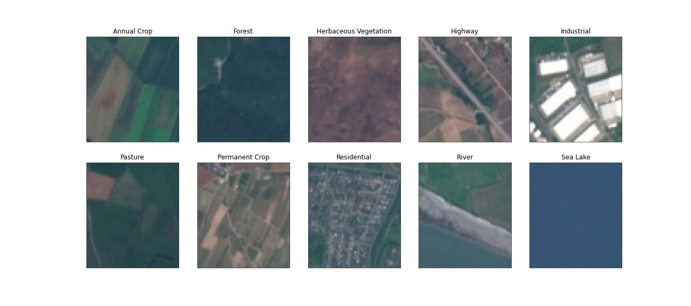

### Classificação de Imagem Usando Transfer Learning

Neste estudo, é abordado o desafio da classificação da cobertura de terras usando imagens de satélite Sentinel-2. As imagens de satélite Sentinel-2 são de acesso aberto e gratuito fornecidas no programa de observação da Terra Copernicus.

O sistema de classificação abre uma porta para uma série de aplicações de observação da Terra podendo ser usado para detectar mudanças no uso e cobertura da terra e como ele pode auxiliar na melhoria dos mapas geográficos.

O conjunto de dados EuroSAT é constituído de 10 classes com 27.000 amostras marcadas e georreferenciadas.

#### Tipos de cobertura de solo
- Annual Crop -> Colheita anual
- Forest -> Floresta
- Herbaceous Vegetation -> Vegetação Herbácea
- Highway -> Área Rodoviária
- Industrial -> Área Industrial
- Pasture -> Pasto
- Permanent Crop -> Colheita Permanente
- Residential -> Área Residencial
- River -> Rio
- Sea Lake -> Lago

#### Imagens de exemplo

#### Transfer Learning
Transfer Learning é a transferência do conhecimento (**feature maps**) que a rede adquiriu de uma tarefa, onde temos uma grande quantidade de dados, para uma nova tarefa, onde os dados não estão disponíveis em abundância. Geralmente é usado onde um modelo de rede neural é treinado pela primeira vez em um problema semelhante ao problema que está sendo resolvido.

A intuição por trás do aprendizado de transferência é que, se um modelo for treinado em um conjunto de dados grande e geral o suficiente, esse modelo servirá efetivamente como uma representação genérica do mundo visual. Podemos então usar os **feature maps** que ele aprendeu, sem ter que treinar em um grande conjunto de dados, transferindo o que aprendeu para nosso modelo e usando isso como um modelo inicial de base para nossa própria tarefa.
